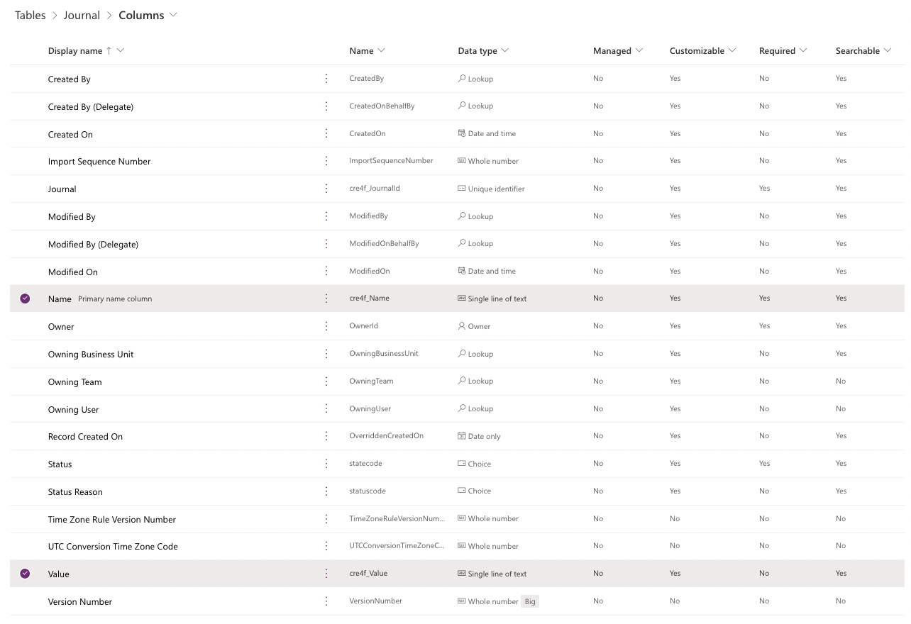

# Dataverse batch on Node.js

## 実装方法

1. Dataverse batchのMultipartリクエストのPayloadを作る
    - 基本的にはODataのbatch requestに従っているが、Dataverse固有の情報が追加されている
    - Microsoft Learnは一部わかりにくいため、ODataのドキュメントも参照
1. AxiosでHTTPリクエストを作ってDataverse Web APIエンドポイントへ送信する
    - ODataとDataverse固有のHeaderを設定する
    - OAuth 2.0の実装も必要

## Multipartリクエストの作り方

### batchのエンドポイント
エンティティに関係なく、以下がエンドポイントとなる。
> [https://org6e45****.api.crm7.dynamics.com/api/data/v9.2/$batch](https://org6e45****.api.crm7.dynamics.com/api/data/v9.2/$batch)

### POSTのBodyの基本形
```
--batch_100
Content-Type: multipart/mixed;boundary=changeset_AA100

<ChangeSet>
<ChangeSet>
<ChangeSet>
...
```

batchリクエストは全て `--batch_###` から始まり、` Content-Type` でMultipartリクエストであることを宣言し、後に続くchangeset名を持つ。

`###` の部分は任意の文字列を入れて構わないが、POSTのHeaderで以下のように `Content-Type` にbatch名を持つので、揃えておく必要がある。

```
'Content-Type': 'multipart/mixed;boundary=batch_100',
```

その後は実際のデータをDataverseへ書き込むchangesetが複数続く。*※QES内部での検証ではDataverseの制約である1000個のchangesetがエラーなしで実行できることを確認*

### changesetの基本形

```
--changeset_AA100
Content-Type: application/http
Content-Transfer-Encoding:binary
Content-ID: 1

POST https://org6e45****.api.crm7.dynamics.com/api/data/v9.2/cre4f_journals HTTP/1.1
Content-Type: application/json;type=entry

{ "key1": "value1", "key2": "value2", ... }
```

changesetはbatchの `Content-Type` で設定したchangeset名を最初に持つ。


次の2つのヘッダーは固定で必要となる。
```
Content-Type: application/http
Content-Transfer-Encoding:binary
```

`Content-ID` は固定ではなく、1つのbatch requestで一意になるようにセットする。CSVファイルからデータをインポートすることを想定すると、行番号と対応させておくと実装しやすい。

次の `POST` で実際のエンティティを指定してDataverseへ書き込むJSONを渡す。
```
POST https://org6e45****.api.crm7.dynamics.com/api/data/v9.2/cre4f_journals HTTP/1.1
Content-Type: application/json;type=entry
```

JSONは実際のエンティティのフィールドに合う形で作る。

例えば、検証では `Journal` というテーブルを作成し、 `Name` と `Value` のカラムを作成している。


このテーブルの `Name` と `Value` に値を入れていく場合は、 `Logical Name` をKeyとして以下のようにJSONを作成する。

```json
{
    "cre4f_name": "...",
    "cre4f_value": "..."
}
```
### changesetを組み立てる

このように作った1つのchangesetが1レコードに対応するので、これを複数繋げることで1つのbatch requestで複数のレコードを作成できる。
```
--changeset_AA100
Content-Type: application/http
Content-Transfer-Encoding:binary
Content-ID: 1

POST https://org6e45****.api.crm7.dynamics.com/api/data/v9.2/cre4f_journals HTTP/1.1
Content-Type: application/json;type=entry

{ "key1": "value1", "key2": "value2", ... }

--changeset_AA100
Content-Type: application/http
Content-Transfer-Encoding:binary
Content-ID: 2

POST https://org6e45****.api.crm7.dynamics.com/api/data/v9.2/cre4f_journals HTTP/1.1
Content-Type: application/json;type=entry

{ "key1": "value1", "key2": "value2", ... }
```

## パフォーマンス
`time` コマンドで1000レコードを作成した時の実行時間を以下に示す。

```
real    0m9.377s
user    0m0.205s
sys     0m0.064s
```
